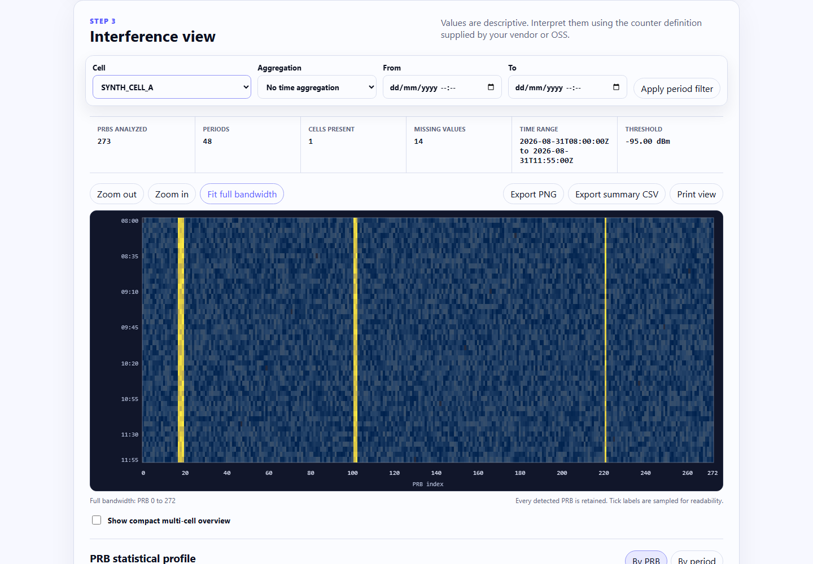

# HiCellTek NR PRB Interference Visualizer

[](https://github.com/tsebai/nr-prb-interference-visualizer/actions/workflows/ci.yml)
[](LICENSE)
[](https://hicelltek.com/tools/nr-prb-interference-visualizer/)

A free, vendor-neutral 5G NR PRB interference visualizer for RAN engineers. Import structured CSV or XLSX counters, map the columns, and inspect a full-bandwidth heatmap, per-PRB statistics, multi-cell comparisons, and exportable summaries.

The complete PRB range fits the available width by default, including 273 PRBs. Every value remains available for exact hover inspection. Zoom, pan, and **Fit full bandwidth** controls support closer analysis without making horizontal scrolling the default.

[Open the live tool](https://hicelltek.com/tools/nr-prb-interference-visualizer/)



## Privacy model

Selected files are read with browser APIs and parsed in a local Web Worker. The engine does not upload the file, its name, headers, cell identifiers, or values. Parsing and visualization libraries are built into the local application assets, with no analysis-time CDN dependency.

The engine emits optional browser-only usage events containing fixed action and context codes. A host can use them for consented product analytics without receiving imported data or file metadata. The live HiCellTek page may count these actions only after analytics consent. See [Local processing](docs/local-processing.md) for the exact boundary and verification method.

## Features

- CSV and XLSX import
- Wide, long, and single-snapshot layouts
- Dynamic PRB header detection for compact, numeric, and prefixed counter names such as `PRB_0`, `RB0`, `7`, and `UL.Interference.Avg.PRB7(dBm)`
- Comma, semicolon, and tab delimiters
- Point and unambiguous decimal comma support
- Modifiable column mapping with worksheet selection and row preview
- dBm, dB, raw counter, and custom units
- Correct linear-power averaging for dBm
- Automatic or manual color scales, thresholds, direction, palettes, cell and time filters, and aggregation intervals
- Canvas heatmap with sparse tick labels, exact hover values, zoom, pan, and full-bandwidth reset
- Persistent cell selector with indexed switching and a bounded compact multi-cell overview
- Switchable PRB and time profiles with minimum, mean, median, maximum, P95, and threshold-exceedance summaries
- PNG heatmap export, safe CSV summary export, and print view
- Synthetic demo datasets and a deterministic sample generator
- Empty wide and long CSV templates available directly from the import panel
- File-size, row-count, and measurement-count safety limits

## Try it locally

Requirements: Node.js 22.13 or later.

```bash
git clone https://github.com/tsebai/nr-prb-interference-visualizer.git
cd nr-prb-interference-visualizer
npm ci
npm run generate:samples
npm run dev
```

Vite prints the local URL. The production build uses the canonical path `/tools/nr-prb-interference-visualizer/`.

## Basic workflow

1. Export PRB interference counters from the gNB or OSS.
2. Remove or anonymize sensitive identifiers.
3. Open the tool.
4. Select CSV or XLSX.
5. Map the columns.
6. Choose the unit and threshold.
7. Generate and export the heatmap.

The tool visualizes the counters provided. It does not validate a manufacturer's counter definition and does not replace analysis by an RF engineer.

## Input layouts

Wide layout:

```csv
timestamp,cell_id,PRB_0,PRB_1,PRB_2
2026-01-01T10:00:00Z,CELL_A,-111.2,-103.8,-109.4
```

Long layout:

```csv
timestamp,cell_id,prb,interference
2026-01-01T10:00:00Z,CELL_A,0,-111.2
2026-01-01T10:00:00Z,CELL_A,1,-103.8
```

A wide row without a timestamp is treated as a snapshot. PRB indices do not need to be continuous and the engine does not assume a fixed PRB count. See [Data formats](docs/data-formats.md) and the files in [`samples/`](samples/).

Exports with separate `Date` and `Time` columns are supported. The automatic mapper prefers an exact `Cell Name`, `cell_id`, or equivalent identifier and does not treat descriptive fields such as a duplex-mode indication as the cell selector.

If you are preparing an export from scratch, use **Download wide CSV template** or **Download long CSV template** in the import panel. Both files contain headers only. Extend the wide template with the PRB columns present in your own counter export.

## Synthetic demonstrations

The repository includes:

- 273 PRBs with persistent narrowband interference
- temporary broadband interference with semicolon delimiters and decimal commas
- long-format measurements for several cells
- controlled missing and invalid values
- a multi-sheet XLSX workbook

All examples are synthetic. They do not reproduce a customer, vendor, gNB, or OSS export.

Regenerate them with:

```bash
npm run generate:samples
```

## Development checks

```bash
npm run format:check
npm run lint
npm run typecheck
npm run test:unit
npm run build
npm run test:e2e
npm run audit
```

The test suite covers format and PRB detection, CSV and XLSX parsing, separators and decimals, dBm and raw averaging, median and P95, missing values, thresholds, multiple cells, snapshots, invalid files, safe CSV exports, browser interaction, responsive full-bandwidth fitting, keyboard use, and network privacy sentinels.

## Reuse and site integration

The generic engine is exposed as the custom element `<nr-prb-visualizer>`. Its build emits a stable JavaScript entry, a stable stylesheet, and a hashed Web Worker. The official site vendors versioned assets and verifies their SHA-256 values. See [Integration](docs/integration.md).

## Technical scope

This is an independent, vendor-neutral visualization tool. Compatibility depends on the structure and meaning of the exported counters.

NR transmission bandwidth configurations vary with channel bandwidth and subcarrier spacing. Section 5.3.2 of [ETSI TS 138 104 V18.13.0](https://www.etsi.org/deliver/etsi_ts/138100_138199/138104/18.13.00_60/ts_138104v181300p.pdf) includes 273 PRBs for 100 MHz with 30 kHz subcarrier spacing in FR1. This engine detects the PRB indices present in the file instead of hardcoding 273.

## Contributing and security

Read [CONTRIBUTING.md](CONTRIBUTING.md), [SECURITY.md](SECURITY.md), and [CODE_OF_CONDUCT.md](CODE_OF_CONDUCT.md) before submitting changes. Runtime dependency notices are in [THIRD_PARTY_NOTICES.md](THIRD_PARTY_NOTICES.md).

## License

MIT License. Copyright 2026 tsebai.
